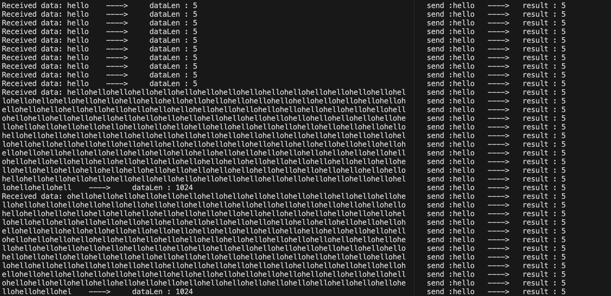
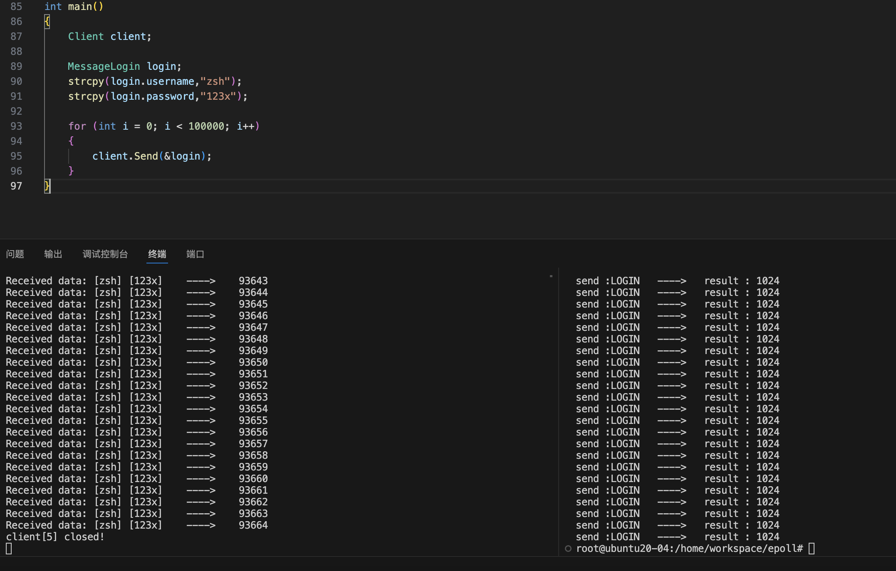
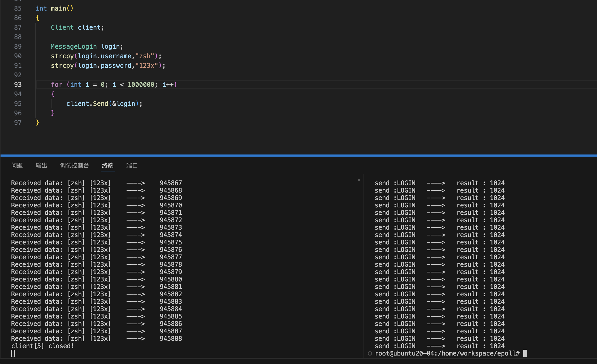
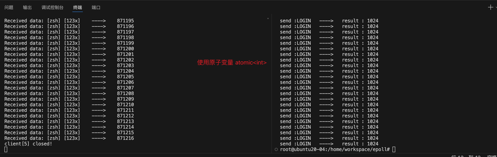
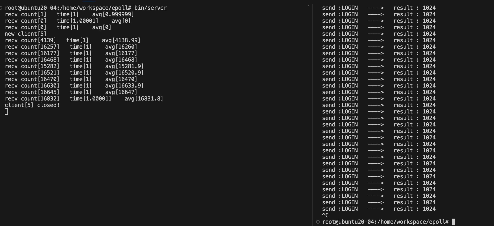

# EPOLL

## 第一阶段

#### 1.简单的 c2s（1w/10w/100w）
    当客户端发送大量数据时，出现粘包问题
#### 2.添加timer计时器，统计每秒包的个数
    简单的c2s，每秒钟server大约接受1.6w个包（每个包1024B）
    

## 并发量测试
#### 1.当client发送大量消息时出现念包问题

#### 2.client分别发送10w个/100w个消息出现少包问题

#### 3.使用原子变量统计100w个消息

#### 4.使用纳秒级计时器统计每秒server接受的包的数量

